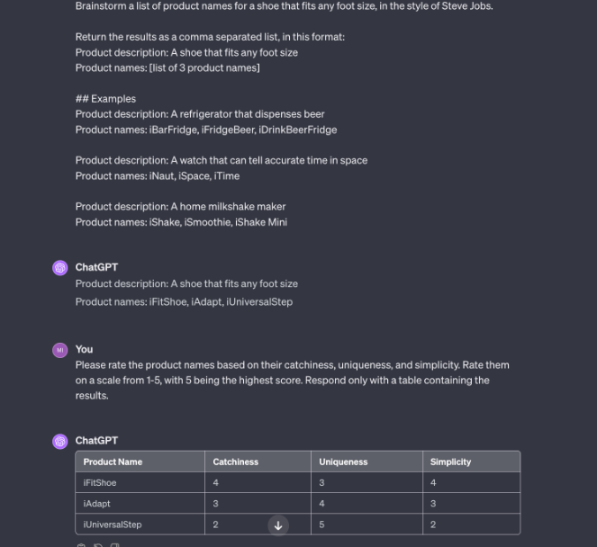

# 5 principles of prompting
1. Give direction

## Prompt Template
1. 
```txt
Brainstorm a list of product names for a {product_description}, in the style of {famous_inventor}.

Return the results as a comma separated list, in this format:
Product description: A shoe that fits any foot size
Product names: [list of 3 product names]

## Examples
{product_examples}
```

2. 
```txt
Please rate the product names based on their catchiness, uniqueness, and simplicity. Rate them on a scale from 1-5, with 5 being the highest score. Respond only with a table containing the results.
```


