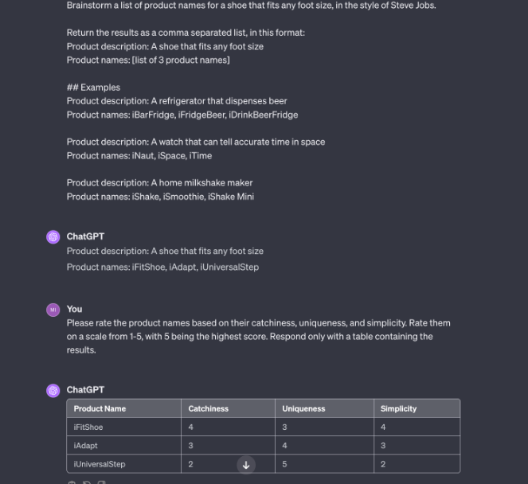

# 5 principles of prompting


## => Giving direction
* **Describe the desired style in detail, or reference a relevant persona.**

* Prompting ChatGPT


Above do a reasonable job

better one -  


## Prompt Template
1. 
```txt
Brainstorm a list of product names for a {product_description}, in the style of {famous_inventor}.

Return the results as a comma separated list, in this format:
Product description: A shoe that fits any foot size
Product names: [list of 3 product names]

## Examples
{product_examples}
```

2. 
```txt
Please rate the product names based on their catchiness, uniqueness, and simplicity. Rate them on a scale from 1-5, with 5 being the highest score. Respond only with a table containing the results.
```




> We can test different parts of this template. And that's the key to understanding prompt engineering . To see how it responds to performance
> Based on your better domain knowledge you can give it better direction

* Impact on Results


### Image Models - Stable Diffusion


> Giving direction is the first thing you should try. Because if you can steer the model towards something that's unique and original then you are going to get much better results specific to your use case

## => Specify Format
* Define what rules to follow, and the required structure of the response


* Impact on reuslts


* For image models


* Impact on results -  


> It take some testing toget what you want in terms of your vision

## => Provide Examples
* Insert a diverse set of test cases where the task was done correctly

* zero shock or few shock method
> Giving direction like steve jobs and format for comma separated is easy. but giving examples is bit of work . you have to find good examples and cherry pick them and put them into the prompt

* Text models -  


* By giving examples you make it more reliable but at the cost of creativity. You are constraining the creativity


* Image models


> in image models you can give example image.

