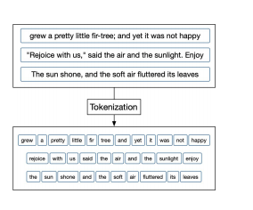
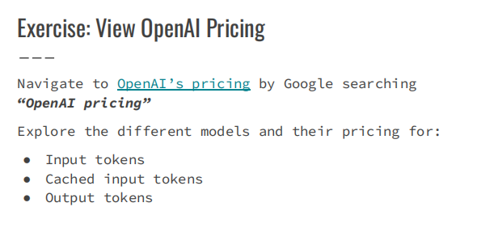
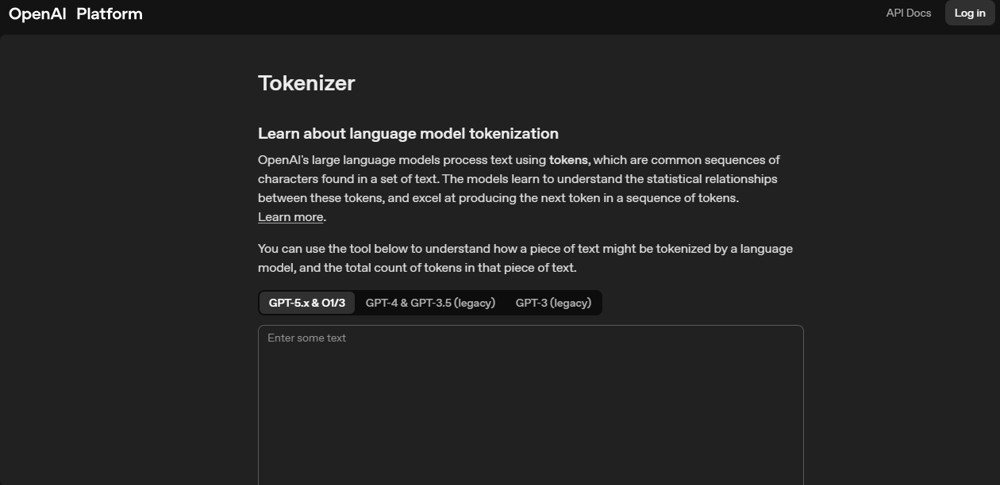
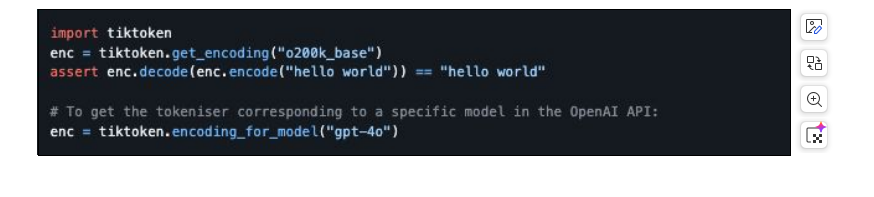
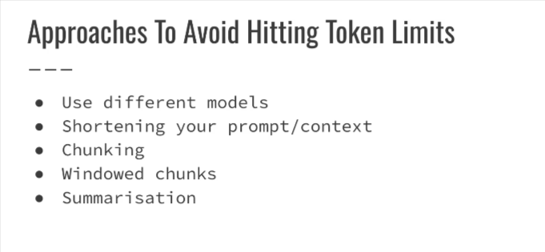

# How does AI work?

## => What are Tokens?
* **Examine token limits what are and how to gracefully handle limits.**

* What is Tokenization
    * Sentences, words and characters are transformed into lots of individual tokens.

* Token Limits
    * Restricted by the models that we choose to use.
    * Each model has an input token limit and and output token limit.

## How to get the token limit for ChatGPT and GPT-X

https://platform.openai.com/tokenizer

* How to get the token limit - Tokenizer
* Using python code

## Approaches to Avoid Hitting token limits

## Chat Models vs Reasoning Models

## AI Hallucinations

