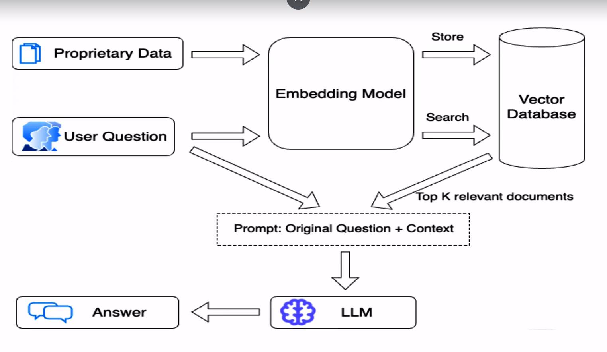

# RAG-LLM Evaluation & Test Automation with RAGAS Pytest Framework

**What will you learn from the course?**

* High-level overview of Large Language Models (LLMs).
* Understanding how custom LLMs are built using the Retrieval-Augmented Generation (RAG) architecture.
* Common benchmarks and evaluation metrics for assessing RAG-based LLMs.
* Introduction to the RAGAS evaluation framework for testing and validating LLMs.
* Writing practical scripts to automate and assert the metric scores of LLMs.
* Automating scenarios such as single-turn and multi-turn interactions with LLMs using the RAGAS framework.
* Generating test data for evaluating LLM metrics using the RAGAS framework.

> We call as LLM Evaluation than as Testing  
We can't put a direct assertion for LLMs  

```text

RAGAS is a Library

```

Now every company is coming up with their own custom LLMs  
They take a base model like and they build a wrapper around it.  

## Course Outcome

* By the end of the course, you will be able to create a **RAGAS Pytest Evaluation Framework** to assert the metrics of RAG-based (custom) LLMs

## Key Metrics

This course covers **7 key evaluation metrics** commonly used to test LLMs. The same approach can be applied to other metric evaluations

## Hands-on Experience

The course provides a **practice RAG-LLM** for hands-on  
learning. However, during the scripting phase, **a basic OpenAI subscription** is required to access APIs (**a minimal $10 credit will suffice)**

## Course Prerequisites

Basic knowledge of **Python and Pytest** is required. The  
course includes **two dedicated sections** at the end,  
covering the essential Python & Pytest concepts needed. A  
basic understanding of **API testing** is also recommended.

## What is Artificial Intelligence (AI)?

Definition: AI is the branch of computer science that creates systems capable of performing tasks requiring human intelligence, such as understanding language, recognizing patterns, decision-making, and
problem-solving.

## What are Large Language Models(LLMs)?

**Definition**

LLMs are advanced AI models trained on vast amounts of text
data to understand, generate, and interact with natural language using deep learning techniques, particularly transformers.

## How LLMs Work

* Pre-Training - Trained on diverse datasets (books, articles, code, etc.) to predict the next word in a sentence.

Example - Given "The capital of Italy is" the model predicts "Rome".

* Fine-Tuning - Refined for specific tasks like customer support or medical diagnosis.

* Inference - Generates responses to user queries using pre-trained knowledge.

## Top 5 LLMs - One liner summaries

1. GPT-4(OpenAI) - Versatile model excelling in multitasking, reasoning, and conversational AI

2. Gemini(Google) - Next-gen AI with advanced reasoning and multi-modal capabilities

3. Claude (Anthropic) - Safety-focused conversational model optimized for ethical AI.

4. GitHub Copilot(OpenAI Codex) - AI assistant for coding, aiding in writing and debugging.

5. Perplexity AI - Combines retrieval-augumented generation with conversational AI for fact-based responses

## LLMs Challenges

1. **Outdated Knowledge**: Pre-trained LLMs may lack recent or domain-specific information (e.g..
company policies. FAQs).
2. **Data Privacy**: LLMs cannot inherently verify or access private/secure documents.
3. **Hallucination**: LLMs can generate fabricated or inaccurate information.

## What is Retrieval Augumented Generation(RAG)? Understand its Architecture  




Absolutely! Let's break down Retrieval Augmented Generation (RAG) and its architecture, referencing the image you provided.

**What is Retrieval Augmented Generation (RAG)?**

RAG is a technique that enhances the capabilities of Large Language Models (LLMs) by grounding them with external, factual data sources.  Think of it as giving the LLM access to an "open book" of knowledge to improve its responses – making them more accurate, relevant, and informative.

**Why is RAG Important?**

LLMs are trained on massive datasets but their knowledge is limited to what they've seen during training. They can also generate incorrect or hallucinated information. RAG addresses these limitations by:

* **Improving Accuracy:** By retrieving relevant information from a reliable source, RAG reduces the likelihood of LLMs fabricating facts.
* **Keeping Information Up-to-Date:** LLMs have a fixed knowledge cutoff. RAG allows them to access current information from external databases, ensuring their responses are timely.
* **Increasing Transparency:** RAG provides context by citing sources, making it clear where the information is coming from and increasing trust in the LLM's output.
* **Enabling Domain Specificity:** RAG can be tailored to specific domains by using specialized knowledge bases, making LLMs more effective in niche applications.

**Architecture Breakdown (Based on Your Image):**

Let's dissect the architecture presented in your image:

1. **Proprietary Data:** This represents your organization's internal or private data sources. It could be documents, wikis, databases, etc. This is the "knowledge base" you want the LLM to access.

2. **Embedding Model:** This model transforms both the "Proprietary Data" and the "User Question" into vector representations (embeddings). Embeddings are numerical representations of text that capture semantic meaning.  Similar content will have vectors close to each other in vector space.

3. **Vector Database:** This specialized database stores the embeddings of your proprietary data, enabling efficient similarity searches.

4. **User Question:** The question or prompt posed by the user.

5. **Search:** The user question's embedding is used to query the vector database and retrieve the "Top K relevant documents" – the documents with the most similar embeddings to the question.

6. **Top K Relevant Documents:** These are the most pertinent pieces of information from your proprietary data that are likely to help answer the user's question.

7. **Prompt: Original Question + Context:** This is a crucial step. The original user question is combined with the retrieved relevant documents to create an enriched prompt. This prompt now contains both the user's query and the necessary context from the knowledge base.

8. **LLM (Large Language Model):**  The enriched prompt is fed into the LLM.

9. **Answer:** The LLM generates a response based on the combined information in the prompt. Since it has access to the relevant context, the answer is more likely to be accurate, informative, and grounded in the provided data.

**In essence, RAG follows these steps:**

1. **Retrieval:** Retrieve relevant information from an external knowledge base based on the user's query.
2. **Augmentation:** Combine the retrieved information with the original query to create a richer prompt.
3. **Generation:** Feed the augmented prompt to the LLM to generate a response.

**Key Components:**

* **Embedding Models:**  Essential for capturing semantic meaning and enabling effective search.
* **Vector Databases:**  Designed for efficient similarity search on vector embeddings.
* **LLMs:** The core component that generates the final answer.

**Benefits of RAG:**

* **Enhanced Accuracy and Factual Grounding**
* **Up-to-Date Information**
* **Increased Transparency and Trust**
* **Domain Customization**
* **Reduced Hallucinations**

**Use Cases for RAG:**

* **Chatbots with Access to Company Knowledge Bases**
* **Question Answering Systems over Proprietary Data**
* **Generating Reports with Supporting Evidence**
* **Personalized Search based on User History**

Let me know if you'd like a deeper dive into any specific aspect of RAG or its architecture!
