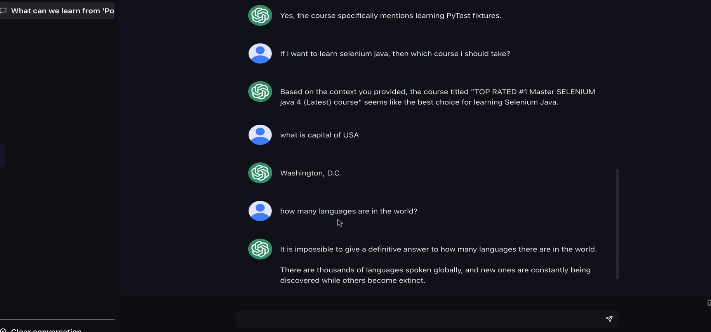

# Getting started with Practice LLM's and the approach to evaluate/Test

## 11. Demo of Practice RAG LLM's to evaluate and write test automation scripts

> From user perspective there is no differentiation whether  
it is a RAG based or a normal LLM. Overall it is a LLM model built on RAG frame. That's all.  

> When you come to testing the first thing what you need to remember is you cannot compare testing normal software application.

### Testing LLMs: A New Approach

* Traditional Software Testing

In traditional software testing, we directly assert on system  
responses. This approach involves comparing expected outputs  
with actual outputs from the system under test.  

* LLM Testing

Testing LLMs involves evaluating the quality of their responses  
using benchmark metrics. These metrics help "sess the model's  
performance based on relevance, accuracy, and other qualitative  
aspects.

## 12. Understanding implementation part of practice RAG LLM's to understand context

API - https://rahulshettyacademy.com/rag-llm/ask

Payload - 

```json
{
    "question": "How many articles are there in the Selenium WebDriver Python course?",
    "chat_history": []
}

```

## 13. Understand conversational LLM scenarios and how they are applied to RAG Arch




Conversational LLM scenarios refer to how Large Language Models (LLMs) engage in dialogues across different contexts, such as customer support, content generation, tutoring, and decision support. In **Retrieval-Augmented Generation (RAG) architecture**, LLMs are combined with information retrieval systems to enhance responses with external, up-to-date, and domain-specific knowledge.  

### **Conversational LLM Scenarios in RAG Architecture**  

1. **Customer Support & Chatbots**  
   - **Application**: Users ask product-related queries, and the LLM fetches relevant knowledge base articles before generating a response.  
   - **RAG Role**: Retrieves FAQs, manuals, and troubleshooting guides in real time, ensuring accurate and context-aware responses.  

2. **Enterprise Knowledge Management**  
   - **Application**: Employees seek information about policies, HR procedures, or IT support within an organization.  
   - **RAG Role**: Connects the LLM with internal documentation, enabling precise answers without needing extensive model fine-tuning.  

3. **Medical & Legal Assistance**  
   - **Application**: Doctors or lawyers ask questions, and the system provides contextually rich answers using medical journals or case law databases.  
   - **RAG Role**: Retrieves up-to-date legal precedents or medical research papers to enhance reliability and accuracy.  

4. **Personalized Tutoring & Learning Assistants**  
   - **Application**: Students ask subject-related questions, and the assistant provides structured explanations.  
   - **RAG Role**: Retrieves content from textbooks, research papers, and verified educational sources before generating an answer.  

5. **Code Assistance & DevOps Automation**  
   - **Application**: Developers seek help with debugging, code generation, or best practices.  
   - **RAG Role**: Retrieves documentation, Stack Overflow discussions, and API references to provide relevant and accurate responses.  

6. **Financial Advisory & Market Insights**  
   - **Application**: Investors query market trends, stock recommendations, or economic analyses.  
   - **RAG Role**: Pulls data from financial reports, SEC filings, and real-time news sources to ensure informed responses.  

### **How RAG Enhances Conversational LLMs**  
- **Accuracy & Freshness**: Retrieves real-time or updated information from external sources, reducing hallucinations.  
- **Domain Adaptability**: Eliminates the need for full retraining by dynamically integrating with structured and unstructured data.  
- **Context Awareness**: Maintains conversation history while fetching relevant information for improved user interactions.  

Would you like a technical breakdown of how to implement RAG in a conversational AI system?