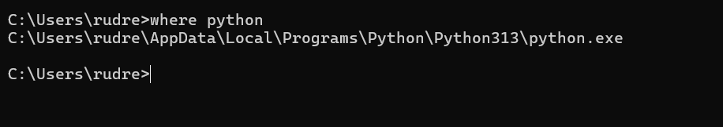
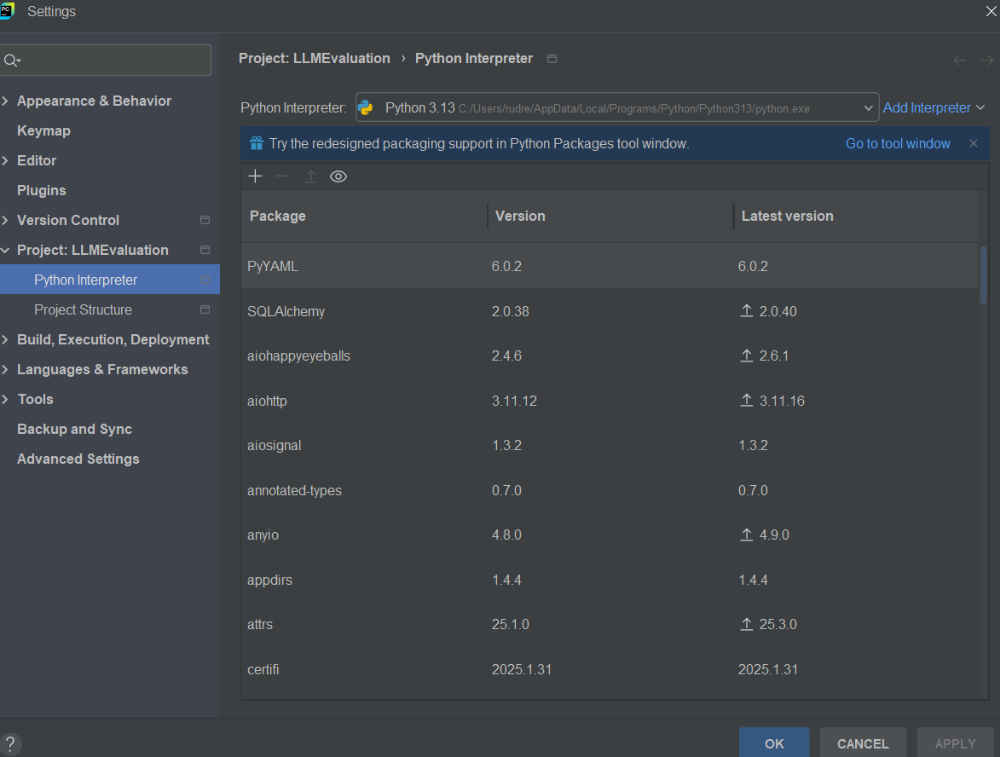
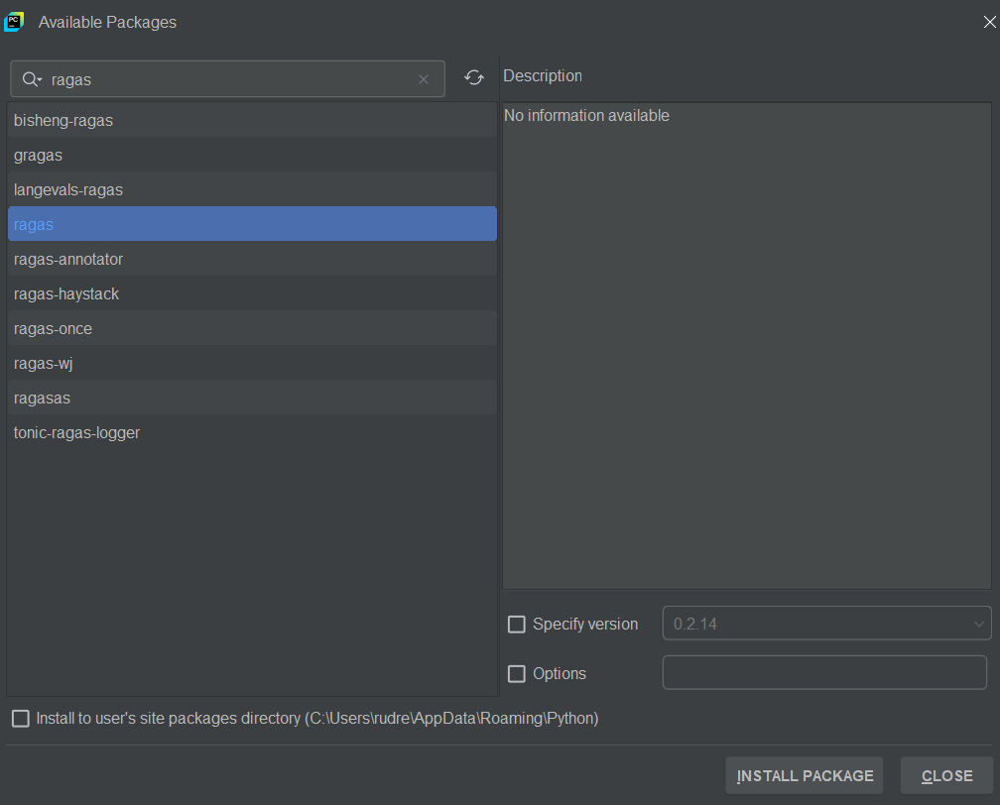

# Setup Python & Pytest Environment with RAGAS LLM Evaluation Package Libraries

## Install and set the path of Python in windows OS

* Install python 

Above path should match with cmd python path

* Install pycharm community version

## 17  Install RAGAS Framework packages and setup the LLM Test project

### Install RAGAS Package

**Use:** It’s used to evaluate RAG (Retrieval-Augmented Generation) pipelines, like those combining LangChain with LLMs.

Why important? Helps measure how well your LLM system retrieves and generates relevant answers using metrics like faithfulness, answer relevancy, context precision, etc.

Useful for: Developers building QA systems or chatbots using retrieval-augmented techniques.

### Install-langchain-openai
This is the OpenAI integration module for LangChain.
Why important? Allows you to easily connect LangChain apps to OpenAI’s LLMs (like GPT-3.5, GPT-4) using a few lines of code.

Useful for: Chatbots, smart document Q&A, AI agents using OpenAI models via LangChain.

### Install pytest package
Use: A testing framework in Python used to write and run unit tests or automation tests.

Why important? Makes it easier to maintain code quality by automating testing. It's especially handy when used with frameworks like Selenium or for API testing.

Useful for: QA Engineers and Developers writing test scripts to ensure code works as expected.

### Install requests package
Use: One of the most popular libraries for sending HTTP requests in Python.

Why important? Makes it easy to interact with APIs—like sending GET, POST, PUT, DELETE requests.

Useful for: Any app or script that needs to talk to a server or pull/send data over the web.

### 18 Python & Pytest Basics

Understanding the basics below is necessary to follow LLM evaluation using RAGAS

· Coding Indentations in Python

· Functions in Python

· Python data types – List & Dictionaries

· Classes & Objects in Python

· Pytest basics & Fixtures

· Conf.py file usage

